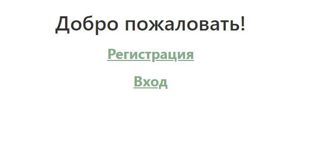
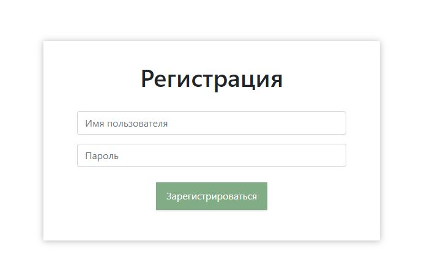
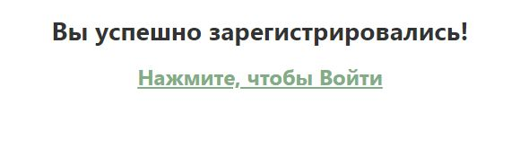
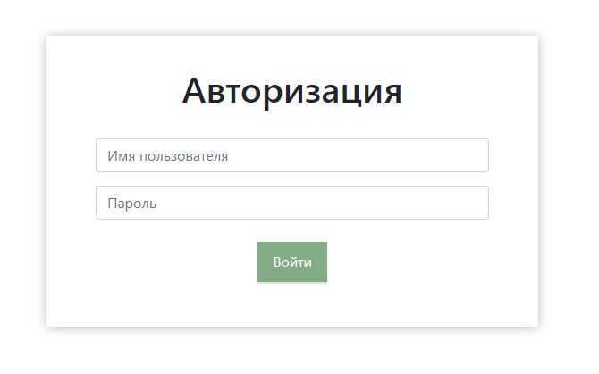
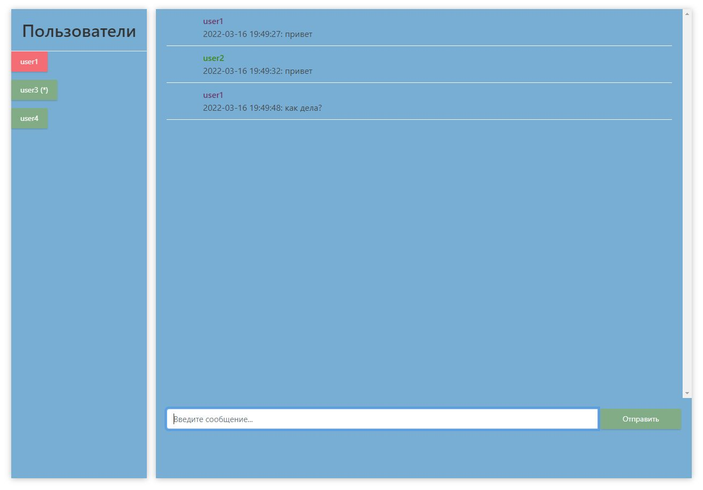

# Проектная Работа

## Тема: Онлайн чат с авторизацией и базой данных

**Цель**:

С помощью технологий и библиотек
- spring boot,
- spring data jdbc (DB PostgreSQL),
- websocket,
- thymeleaf

реализовать **онлайн чат** поддерживающий следующий функционал:
- регистрация нового пользователя (с использованием БД)
- авторизация зарегистрированного пользователя (с использованием БД)
- возможность онлайн переписки с зарегистрированными пользователями
- сохранение/восстановление истории переписки с использованием БД
- возможность переключения чата пользователем

# Презентация работы проекта (видеопрезентация: https://disk.yandex.ru/i/Imq6CP1rEaypSQ)

Изначально пользователь попадает на страницу приветствия, где можно **зарегистрироваться** либо **войти**:

При выборе пункта **Зарегистрироваться** пользователь попадает на страницу **регистрации**:

После успешной регистрации пользователь попадает на страницу **успешная регистрация**, на которой можно выполнить **вход**:

При выборе **Нажмите, чтобы Войти**  пользователь попадает на страницу **входа**:

После успешного входа пользователь попадает на **страницу чата** со списком зарегистрированных пользователей:

После выбора пользователя с которым будет производиться переписка открывается область непосредственно чата, куда подгружается история переписки, **красным цветом** выделяется пользователь, с которым в данный момент ведется переписка. (*) помечаются пользователи, по которым поступили новые сообщения:

В заголовке страницы отображается информация о пользователе, под которым выполнен вход и о пользователе, с которым в данный момент ведется переписка:

